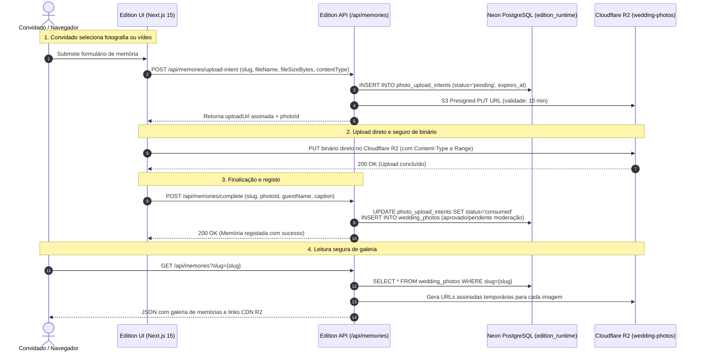

# HAXR Signature — Edition Engine

**Motor de experiências cerimoniais e convites digitais de alta-costura.**

O **HAXR Signature Edition Engine** é uma plataforma dedicada a renderizar convites digitais imersivos e gerir a interação dos convidados em cerimónias de prestígio (casamentos tradicionais/Lobolo, recepções de gala e aniversários exclusivos). O motor combina narrativa visual cinematográfica com uma infraestrutura de produção de alta performance e resiliência.

| Recurso | Destino Canónico |
| :--- | :--- |
| **Ambiente de Produção** | [https://edition.haxrsignature.com](https://edition.haxrsignature.com) |
| **Repositório GitHub** | [MrDimande/haxrsignature-edition-engine](https://github.com/MrDimande/haxrsignature-edition-engine) |

---

## 1. Visão Geral do Produto

Ao contrário de geradores de convites convencionais, o Edition Engine opera como um sistema de experiências digitais fechadas por slug privado:
- **Narrativa Cerimonial:** Cada celebração possui uma identidade artística única (tipografia, ambient soundtrack, paleta cromática e rituais culturais de boas-vindas).
- **Interação do Convidado:** Confirmação de presença (RSVP multi-etapas com acompanhantes), lista de presentes com reserva atómica em tempo real e mural vivo de memórias (*Plus Memories*).
- **Sem Listagem Pública:** A rota raiz (`/`) não indexa nem expõe listas de casais. O acesso é estritamente baseado no slug autorizado do evento (`/[slug]`), preservando a privacidade e discrição dos anfitriões.

---

## 2. Arquitetura de Produção e Pipeline de Memórias

O ecossistema opera sem dependência de serviços legados, ancorado em **Neon Serverless PostgreSQL** e **Cloudflare R2**:



---

## 3. Módulos & Domínios Centrais

### Experiências de Convite Dinâmicas (`/[slug]`)
O roteamento dinâmico do Next.js resolve eventos autorizados sem duplicação de base de código. Exemplos de celebrações canónicas:
- `/jessicasamuelwedding`: Cerimónia formal religiosa e recepção de casamento.
- `/jessicaesamueltraditionalwedding`: Cerimónia tradicional e Lobolo.
- `/jessicachadelingerie`: Chá de despedida e celebração privada.
- `/queenkailanecrisma`: Celebração cerimonial e banquete de crisma.
- `/stanturns5`: Celebração infantil temática de prestígio.

### Arquitetura de RSVP
- **Validação Local & Servidor:** Sanitização estrita de nomes, contactos telefónicos (+258 normalizado), número de acompanhantes e opções de presença (`attending: boolean`).
- **Portão de Persistência Fail-Closed:** Em produção, uma resposta de RSVP só produz estado visual de sucesso quando `success: true` e `persisted: true` são confirmados pela camada de base de dados.
- **Prevenção de Cliques Duplos:** Chaves de idempotência baseadas no contacto e slug do evento.

### Lista de Presentes & Reserva Atómica (Gifts Inventory)
- **Consistência em Tempo Real:** Listas de presentes exclusivas (como *Rose Elegance* e *Stan Gifts*) integradas diretamente com a base de dados.
- **Reserva Concorrente Segura:** Bloqueio e reserva atómica de itens no Neon DB (`edition_gift_reservations`), prevenindo que o mesmo presente seja reservado em duplicado por convidados distintos em simultâneo.

### Pipeline de Memórias (*Plus Memories*)
- **Famílias de Média Suportadas:** `image/jpeg`, `image/png`, `image/webp`, `image/heic`, `video/mp4`, `video/quicktime`.
- **Validação de Assinatura de Ficheiro (Magic Bytes):** Verificação de cabeçalhos binários antes da aceitação do upload, prevenindo extensões falsificadas.
- **Gamificação e Desafios:** Desafios de fotografia durante a recepção (*Explorador da Noite*), identificação de mesas e quadro de líderes em tempo real.

---

## 4. Base de Dados (Neon PostgreSQL)

A persistência do motor Edition utiliza **Neon Serverless PostgreSQL**:
- **Papel de Runtime:** Conexão efetuada exclusivamente através do utilizador `edition_runtime`.
- **Segurança ao Nível da Linha (Row-Level Security):** RLS ativado nas tabelas operacionais (`photo_upload_intents`, `wedding_photos`, `edition_gift_reservations`), isolando mutações não autorizadas.
- **Pooling Inteligente:** Suporte a conexões pooled para absorver picos de tráfego de convidados durante eventos ao vivo, com timeout de conexão calibrado (`10_000ms`).

---

## 5. Armazenamento de Média (Cloudflare R2)

- **Bucket Dedicado:** `wedding-photos` na infraestrutura Cloudflare R2 (compatível com S3).
- **Sem Leitura Pública Aberta:** Todo o acesso aos ficheiros originais e transformados requer assinatura criptográfica temporária com expiração restrita.
- **Caminhos de Armazenamento Padronizados:**
  ```text
  {invitation_slug}/{photo_id}/original.{ext}
  ```

---

## 6. Rate Limiting e Validação Defensiva

Para proteger a integridade da aplicação contra abusos ou Denial of Wallet:
- **Rate Limit Deslizante:** Limite de criação de intents por IP e por slug de evento (`api_rate_limits` em PostgreSQL), devolvendo `HTTP 429 Too Many Requests` com cabeçalho `Retry-After`.
- **Validação de Tamanho:** Rejeição imediata de ficheiros que excedam os limites autorizados (ex: 25MB para imagens, 100MB para vídeos).
- **Proteção Contra Ficheiros Órfãos:** Intents de upload expiram automaticamente após 15 minutos se o upload não for consumido e completado.

---

## 7. Modelo de Segurança

- **Resolução Exclusivamente Baseada em Slug:** Impossível enumerar eventos através de varrimento de IDs inteiros.
- **Autenticação Bearer em Endpoints Administrativos:** Rotas de moderação de fotografias (`/api/memories/moderate`) e exportação em lote (`/api/memories/export-zip`) exigem token Bearer administrativo secreto.
- **Isolamento de Segredos:** Credenciais de escrita e chaves de acesso R2 operam estritamente no backend.

---

## 8. Desenvolvimento Local

### Pré-requisitos
- Node.js 20+
- npm 10+

### Instalação
```bash
git clone https://github.com/MrDimande/haxrsignature-edition-engine.git
cd haxrsignature-edition-engine
npm install
```

### Comandos Principais
```bash
# Iniciar servidor local em http://localhost:3000
npm run dev

# Executar suite completa de testes automatizados
npm test

# Validação estrita de tipos TypeScript
npx tsc --noEmit

# Build de produção
npm run build
```

---

## 9. Variáveis de Ambiente

Configure as seguintes variáveis no ficheiro `.env.local` (nunca versionado no Git):

| Variável | Obrigatória | Âmbito | Finalidade |
| :--- | :---: | :--- | :--- |
| `DATABASE_URL` | **Sim** | Server | Connection string com pooler do Neon para o utilizador `edition_runtime` |
| `DATABASE_PROVIDER` | **Sim** | Server | Provedor de base de dados canónico (`neon`) |
| `STORAGE_PROVIDER` | **Sim** | Server | Provedor de storage canónico (`r2-s3`) |
| `CLOUDFLARE_R2_ACCESS_KEY_ID` | **Sim** | Server | Chave de acesso S3 para o bucket R2 `wedding-photos` |
| `CLOUDFLARE_R2_SECRET_ACCESS_KEY` | **Sim** | Server | Chave secreta S3 para o bucket R2 `wedding-photos` |
| `CLOUDFLARE_R2_ENDPOINT` | **Sim** | Server | Endpoint S3 HTTPS do Cloudflare R2 |
| `CLOUDFLARE_R2_BUCKET_NAME` | **Sim** | Server | Nome do bucket R2 de fotografias (`wedding-photos`) |
| `HAXR_MEMORIES_ADMIN_TOKEN` | **Sim** | Server | Token Bearer para rotas de moderação e exportação de memórias |
| `NEXT_PUBLIC_SITE_URL` | **Sim** | Public | Domínio canónico público (`https://edition.haxrsignature.com`) |

---

## 10. Deployment & Recuperação de Desastres

- **Plataforma de Deploy:** Vercel ligada ao branch `main` de `MrDimande/haxrsignature-edition-engine`.
- **Princípio de Resposta a Incidentes (*Repair-Forward*):** Qualquer anomalia em produção é tratada através de intervenção corretiva direta no código e deployment em frente. Não é autorizada a reversão para o repositório ou snapshot histórico da Supabase.
- **Histórico de Migração:** A saída definitiva da infraestrutura Supabase foi concluída com sucesso em 2026-09-06 (Tag: `supabase-exit-2026-09-06`).
