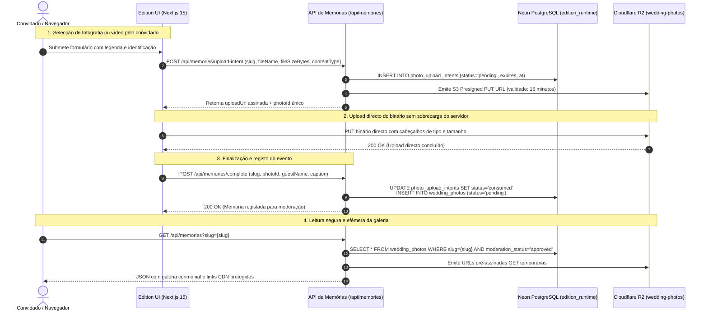

# HAXR Signature — Edition Engine

```text
  ███████╗██████╗ ██╗████████╗██╗ ██████╗ ███╗   ██╗    ███████╗███╗   ██╗ ██████╗ ██╗███╗   ██╗███████╗
  ██╔════╝██╔══██╗██║╚══██╔══╝██║██╔═══██╗████╗  ██║    ██╔════╝████╗  ██║██╔════╝ ██║████╗  ██║██╔════╝
  █████╗  ██║  ██║██║   ██║   ██║██║   ██║██╔██╗ ██║    █████╗  ██╔██╗ ██║██║  ███╗██║██╔██╗ ██║█████╗  
  ██╔══╝  ██║  ██║██║   ██║   ██║██║   ██║██║╚██╗██║    ██╔══╝  ██║╚██╗██║██║   ██║██║██║╚██╗██║██╔══╝  
  ███████╗██████╔╝██║   ██║   ██║╚██████╔╝██║ ╚████║    ███████╗██║ ╚████║╚██████╔╝██║██║ ╚████║███████╗
  ╚══════╝╚═════╝ ╚═╝   ╚═╝   ╚═╝ ╚═════╝ ╚═╝  ╚═══╝    ╚══════╝╚═╝  ╚═══╝ ╚═════╝ ╚═╝╚═╝  ╚═══╝╚══════╝
                                 CEREMONIAL EXPERIENCES & PRIVATE INVITATIONS
```

> **Manifesto do Motor de Edições Cerimoniais**  
> Um convite de alta-costura não é um mero panfleto digital descarregável nem uma página estática genérica. É uma narrativa cerimonial viva, cinematográfica e imersiva que estabelece o tom emocional e a distinção de um casamento de elite, Lobolo tradicional ou gala privada. O HAXR Edition Engine orquestra cada interacção — da confirmação de presença (RSVP) à reserva atómica de presentes e à partilha espontânea de memórias fotográficas — sobre uma arquitectura de alta disponibilidade que garante privacidade absoluta, segurança criptográfica e resiliência em tempo real.

---

## Estado Canónico da Arquitectura

| Dimensão | Estado de Produção | Referência Técnica |
| :--- | :--- | :--- |
| **Ambiente Canónico** | `https://edition.haxrsignature.com` | Plataforma de experiências cerimoniais por slug privado |
| **Repositório Central** | `MrDimande/haxrsignature-edition-engine` | Motor dedicado de experiências de convite |
| **Estado de Migração** | `FECHADA (CLOSED)` | Selo: `supabase-exit-2026-09-06` |
| **Dependência Supabase Runtime** | `ZERO (0.00%)` | Tráfego activo opera 100% em Neon e R2 |
| **Base de Dados Canónica** | `Neon Serverless PostgreSQL` | Papel: `edition_runtime` com isolamento por RLS |
| **Armazenamento de Média** | `Cloudflare R2` | Bucket: `wedding-photos` com acesso assinado |
| **Integridade Operacional** | `APROVADA` | Cobertura de testes unitários e testes de concorrência |

---

## Pilha Tecnológica Canónica (Technology Stack)

A tabela reflecte com exactidão as dependências instaladas e utilizadas no projecto (`package.json` e `package-lock.json`):

| Camada Arquitectural | Tecnologia / Pacote | Versão Instalada | Finalidade no Projecto |
| :--- | :--- | :--- | :--- |
| **Framework Web** | `Next.js` | `15.5.19` | App Router e renderização de experiências dinâmicas `/[slug]` |
| **Biblioteca de Interface** | `React` / `React DOM` | `19.0.0` | Renderização reactiva de cerimónias e componentes interactivos |
| **Linguagem de Programação**| `TypeScript` | `^5` (`5.8.3`) | Verificação estrita de tipos e segurança em tempo de compilação |
| **Ambiente de Execução** | `Node.js` | `^20` / `22.x LTS` | Ambiente serverless na Vercel e motor de execução de testes |
| **Estilos & Layout** | `Tailwind CSS` | `^4` (`@tailwindcss/postcss`) | Motor CSS modular optimizado para carregamento instantâneo |
| **Motion & Animações** | `Framer Motion` / `Motion`| `^12.40.0` | Transições fluídas, revelações cerimoniais e micro-interacções |
| **Scroll Suave** | `Lenis` | `^1.3.23` | Experiência de deslocação vertical editorial e sem atrito |
| **Base de Dados Principal** | `PostgreSQL (Neon)` | `pg ^8.23.0` | Driver nativo conectado com pooler e papel `edition_runtime` |
| **Armazenamento de Objectos**| `@aws-sdk/client-s3` | `^3.1127.0` | Manipulação de fotografias e vídeos em Cloudflare R2 |
| **Segurança de Uploads** | `@aws-sdk/s3-request-presigner`| `^3.1127.0` | Emissão de URLs assinadas PUT/GET temporárias (15 minutos) |
| **Manipulação de Ficheiros**| `JSZip` | `^3.10.1` | Compactação de fotografias de eventos para exportação em lote |
| **Captura de Imagem** | `html-to-image` | `^1.11.13` | Geração de cartões e comprovativos visuais no navegador |
| **Serviço de Email** | `Resend` | `^6.12.4` | Envio de lembretes e confirmações formais de presença |
| **Iconografia** | `Lucide React` | `^1.21.0` | Ícones de navegação e acção cerimonial |
| **Execução de Testes** | Node Test Runner / `tsx` | `tsx ^4.22.4` | Execução dos testes automatizados de RSVP, storage e Neon DB |
| **Plataforma de Alojamento** | `Vercel` | Edge / Serverless | Implementação contínua associada ao branch `main` |

---

## Diagrama de Sequência: Pipeline de Memórias (*Plus Memories*)



---

## Módulos & Domínios Centrais

### 1. Roteamento Dinâmico de Celebrações Privadas (`/[slug]`)
A raiz (`/`) da plataforma não expõe nem indexa casais por motivos estritos de discrição e confidencialidade. Cada evento é acedido unicamente através do seu identificador canónico privado:
- `/jessicasamuelwedding`: Cerimónia formal religiosa e recepção de gala.
- `/jessicaesamueltraditionalwedding`: Cerimónia tradicional e celebração de Lobolo.
- `/jessicachadelingerie`: Chá de despedida e celebração privada entre amigas.
- `/queenkailanecrisma`: Celebração cerimonial e banquete de crisma.
- `/stanturns5`: Celebração infantil temática de prestígio.

### 2. Confirmação de Presença (RSVP) em Múltiplas Etapas
- Sanitização rigorosa de nomes e contactos telefónicos internacionais (formato Moçambique `+258` normalizado).
- Registo detalhado de acompanhantes e requisitos alimentares ou de acessibilidade.
- Disciplina *Fail-Closed*: a confirmação só é apresentada ao utilizador após garantia atómica de persistência na base de dados (`persisted: true`).

### 3. Reserva Atómica de Presentes (*Gifts Inventory*)
- Listas exclusivas de presentes curados integradas na base de dados.
- Bloqueio concorrente atómico no Neon DB (`edition_gift_reservations`), prevenindo a reserva duplicada do mesmo item por convidados diferentes em simultâneo.

### 4. Gestão de Memórias & Desafios (*Plus Memories*)
- Suporte a múltiplos formatos: `image/jpeg`, `image/png`, `image/webp`, `image/heic`, `video/mp4`, `video/quicktime`.
- Validação defensiva de cabeçalhos de ficheiro (*magic bytes*) antes da autorização do upload.
- Gamificação cerimonial com desafios fotográficos durante a festa e quadro de líderes (*Leaderboard*) moderado.

---

## Segurança, Menor Privilégio & Rate Limiting

- **Papel de Menor Privilégio:** Conexões à base de dados limitadas ao papel `edition_runtime`.
- **Row-Level Security (RLS):** Tabelas operacionais (`photo_upload_intents`, `wedding_photos`, `edition_gift_reservations`) protegidas por políticas de segurança ao nível da linha.
- **Rate Limiting em Janela Deslizante:** Protecção contra negação de serviço e abuso de custos (*Denial of Wallet*) através de verificação de pedidos por IP e slug (`api_rate_limits` em PostgreSQL), devolvendo `HTTP 429` com cabeçalho `Retry-After`.
- **Autenticação Administrativa para Moderação:** Rotas de moderação de fotografias (`/api/memories/moderate`) e exportação em lote (`/api/memories/export-zip`) exigem token Bearer secreto (`HAXR_MEMORIES_ADMIN_TOKEN`).

---

## Desenvolvimento Local

### Pré-requisitos
- Node.js versão 20+ ou 22.x LTS
- npm 10+

### Instalação e Testes

```bash
# Clonar o repositório do motor
git clone https://github.com/MrDimande/haxrsignature-edition-engine.git
cd haxrsignature-edition-engine

# Instalação limpa de dependências
npm install

# Iniciar servidor local em http://localhost:3000
npm run dev

# Execução da suite completa de testes automatizados
npm test

# Verificação estrita de tipos TypeScript
npm run typecheck

# Compilação para produção
npm run build
```

---

## Variáveis de Ambiente Canónicas

Configure as seguintes variáveis no ficheiro `.env.local` (nunca versionado no Git):

| Variável | Obrigatória | Âmbito | Descrição e Finalidade |
| :--- | :---: | :--- | :--- |
| `DATABASE_URL` | **Sim** | Servidor | Conexão pooled do Neon PostgreSQL para `edition_runtime` |
| `DATABASE_PROVIDER` | **Sim** | Servidor | Provedor de base de dados canónico (`neon`) |
| `STORAGE_PROVIDER` | **Sim** | Servidor | Provedor de armazenamento canónico (`r2-s3`) |
| `CLOUDFLARE_R2_ACCESS_KEY_ID` | **Sim** | Servidor | Chave de acesso S3 para o bucket `wedding-photos` |
| `CLOUDFLARE_R2_SECRET_ACCESS_KEY` | **Sim** | Servidor | Chave secreta S3 para o bucket `wedding-photos` |
| `CLOUDFLARE_R2_ENDPOINT` | **Sim** | Servidor | Endpoint HTTPS S3 do Cloudflare R2 |
| `CLOUDFLARE_R2_BUCKET_NAME` | **Sim** | Servidor | Nome do bucket R2 de fotografias (`wedding-photos`) |
| `HAXR_MEMORIES_ADMIN_TOKEN` | **Sim** | Servidor | Token Bearer para moderação e exportação de memórias |
| `NEXT_PUBLIC_SITE_URL` | **Sim** | Público | Domínio canónico público (`https://edition.haxrsignature.com`) |

---

## Continuidade Operacional & Recuperação de Desastres

- **Deployment Automatizado:** Implementação atómica via Vercel a cada actualização no branch `main`.
- **Princípio Operacional (*Repair-Forward*):** Quaisquer anomalias são corrigidas por evolução directa do código e implementação contínua. É estritamente proibido o restauro cego a partir do arquivo histórico da Supabase.
- **Histórico da Migração:** A saída formal da infraestrutura Supabase para Neon e Cloudflare R2 foi concluída em **2026-09-06** (Tag: `supabase-exit-2026-09-06`).

---

## Licenciamento & Propriedade Intelectual

- **Código Proprietário:** O HAXR Signature Edition Engine e todos os temas de experiência cerimonial são propriedade confidencial e exclusiva da HAXR Signature. Todos os direitos reservados.
- **Licenças de Activos e Áudio:** O uso de elementos sonoros (como faixas musicais autorizadas para temas de Lobolo) é gerido sob autorização directa com os titulares de direitos, conforme documentado em [`docs/ASSET_LICENSES.md`](./docs/ASSET_LICENSES.md).
