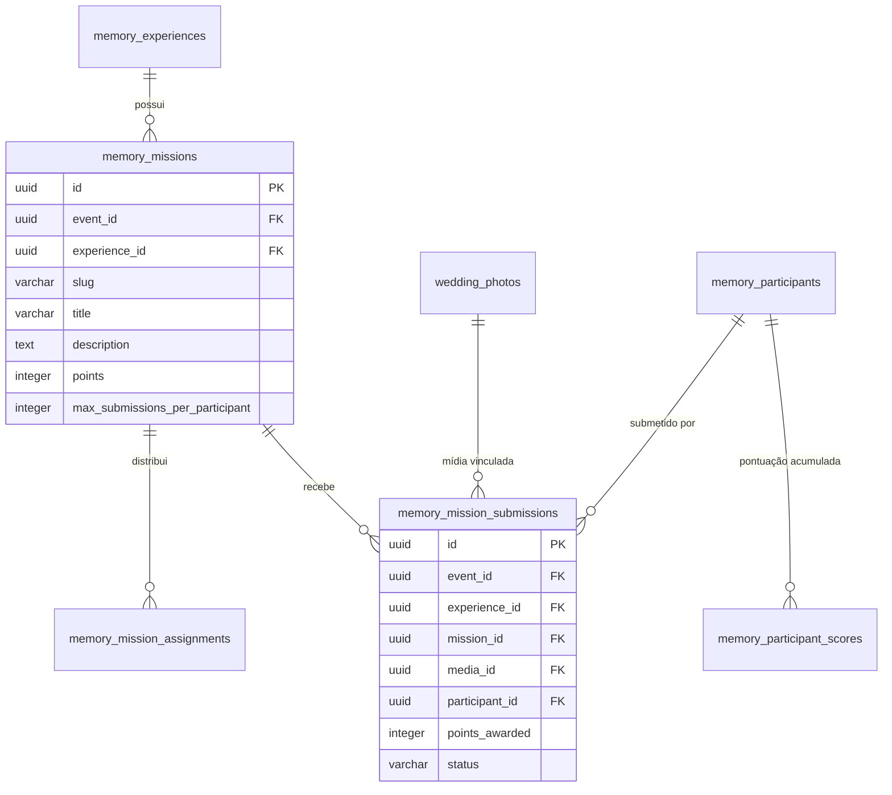

# HAXR PLUS MEMORIES 2.0 — RELATÓRIO TÉCNICO DA FASE 3
## I SPY / MISSION ENGINE 2.0 + PONTUAÇÃO SERVER-SIDE + EXPLORADORES

**Worktree**: `C:\project-x\haxrsignature\.codex-worktrees\plus-memories-2`  
**Neon Preview**: `br-flat-block-ayfks0so` (Project: `little-band-06036174`)  
**Production Parent (Isolada/Intocada)**: `br-wandering-bonus-ay2ex5lx`  
**Estado da Validação**: `PHASE_3_FINAL_STATUS: PASSED (100% CONFORME)`

---

### 1. RESUMO EXECUTIVO DA ARQUITECTURA
A Fase 3 transformou a experiência interactiva "Eu Espio" num motor configurável de missões (`I Spy / Mission Engine 2.0`), integrando pontuação estritamente server-side e ranking determinístico dos Exploradores, preservando 100% da integridade relacional existente e do Media Core (`wedding_photos`).

Principais realizações:
- **Zero Duplicação de Mídia**: Submissões de missões apontam directamente para `wedding_photos.id` via chave estrangeira composta `(event_id, experience_id, media_id)`.
- **Integridade Composta Multi-Tenant**: Toda a tabela (`memory_missions`, `memory_mission_assignments`, `memory_mission_submissions`, `memory_participant_scores`) possui integridade composta `(event_id, experience_id)` vinculada à base de dados. É matematicamente impossível submeter mídia de um evento/experiência para uma missão de outro evento/experiência.
- **Pontuação 100% Server-Side**: O cliente/navegador nunca envia pontuações. Qualquer payload do cliente com campo de pontos é descartado. A pontuação é computada pelo servidor a partir de `memory_missions.points` e acumulada atomicamente sob lock transaccional (`pg_advisory_xact_lock`).
- **Idempotência e Concorrência**: Requisições simultâneas ou repetidas da mesma mídia e missão são idempotentes graças à constraint única `(mission_id, media_id)` e lock de transacção.
- **Princípio de Mínimo Privilégio**: As roles de guest runtime (`edition_runtime`, `haxr_edition_runtime`) têm privilégios estritamente de leitura em missões e ranking, com revogação total de escrita directa em pontuações (`memory_participant_scores`).
- **Retrocompatibilidade com Jessica & Samuel**: As 147 fotos canónicas existentes no evento foram mantidas intactas. Os 12 desafios canónicos foram provisionados como missões persistidas.

---

### 2. MICRO-HARDENING DE `haxr_current_participant_id()`
- **Definição**:
  ```sql
  CREATE OR REPLACE FUNCTION haxr_current_participant_id()
  RETURNS uuid
  LANGUAGE plpgsql
  SECURITY DEFINER
  SET search_path = public, pg_temp
  AS $$
  BEGIN
    RETURN NULLIF(current_setting('haxr.current_participant_id', true), '')::uuid;
  EXCEPTION
    WHEN OTHERS THEN
      RETURN NULL;
  END;
  $$;

  REVOKE ALL ON FUNCTION haxr_current_participant_id() FROM PUBLIC;
  GRANT EXECUTE ON FUNCTION haxr_current_participant_id() TO edition_runtime, haxr_edition_runtime, haxrweb_runtime;
  ```
- **Garantias**: Imunidade contra sequestro de `search_path`, protecção `SECURITY DEFINER` e execução restrita exclusivamente aos papéis runtime autorizados.

---

### 3. MODELO DE DADOS & INTEGRIDADE RELACIONAL



---

### 4. RESULTADOS DE TESTES AUTOMATIZADOS (PREVIEW)

Execução em Preview `br-flat-block-ayfks0so` (`scripts/test-phase-3-preview.mjs`):
- **Total de Verificações**: 59
- **Aprovados**: 59 (100%)
- **Falhas**: 0
- **Baseline de Fotos**: Exactamente 147 fotos mantidas antes e após a suite.
- **Fixtures Limpas**: 0 submissões e 0 pontuações residuais pós-teste.

Cenários validados na totalidade:
- **Cenário 0**: Micro-Hardening de `haxr_current_participant_id()` (`SECURITY DEFINER`, `search_path=public, pg_temp`, `REVOKE FROM PUBLIC`).
- **Cenários 1, 2, 3, 3B, 3C**: Integridade relacional estrita cross-event e cross-experience nas tabelas de missões, assignments e submissões.
- **Cenário 3D**: Integridade polimórfica de `target_id` (`general`, `participant`, `guest`, `table`) com rejeição em banco via trigger.
- **Cenário 4**: Submissão negada para participantes não elegíveis.
- **Cenário 5**: Pontuação 100% server-side (payload do cliente com pontos forjados é desconsiderado).
- **Cenário 6**: Idempotência de submissões repetidas (mesma mídia + mesma missão).
- **Cenários 7 & 8**: Concorrência e idempotência sob locks transaccionais.
- **Cenários 9 & 10**: Políticas de missões únicas vs repetíveis (respeitando limites configurados).
- **Cenário 11**: Rejeição de missões com janela temporal expirada.
- **Cenários 12, 12B, 12C**: Máquina de estados transaccional de moderação (`haxr_moderate_mission_submission`), transições `pending -> accepted -> rejected -> accepted`, reversão integral de pontos, idempotência de moderação e serialização concorrente via `pg_advisory_xact_lock`.
- **Cenários 13 & 14**: Feature flag `competition_enabled` e slugs/categorias customizadas.
- **Cenário 15**: Classificação determinística server-side dos Exploradores.
- **Cenário 16**: Princípio de menor privilégio e RLS aplicadas aos papéis runtime.

---

### 5. GATES DE ENGENHARIA CONCLUÍDOS
- `npm test`: 308 testes unitários aprovados (0 falhas).
- `npm run typecheck`: 100% de conformidade com TypeScript rigoroso (`tsc --noEmit`).
- `npm run lint`: 0 erros de linting (`eslint`).
- `npm run secret-scan`: 0 segredos detectados.
- `npm run build`: 53 rotas estáticas e dinâmicas compiladas com sucesso em produção Next.js 15.
- `git diff --check`: Verificado sem conflitos nem espaços em branco residuais.
- **Produção Parent (`br-wandering-bonus-ay2ex5lx`)**: 100% intocada e isolada.
