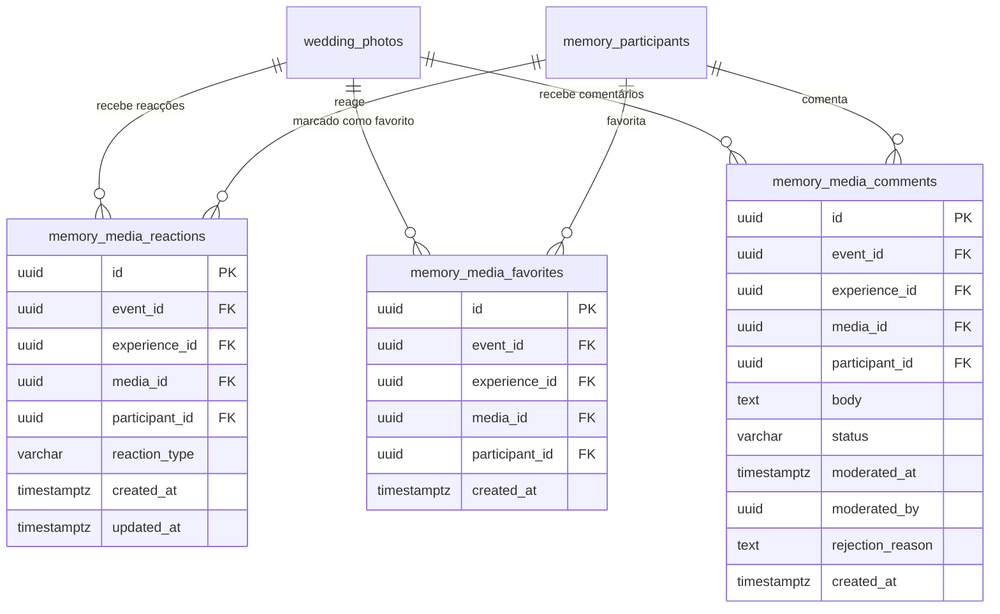

# HAXR PLUS MEMORIES 2.0 — RELATÓRIO TÉCNICO DA FASE 4
## SOCIAL PRIVADO & ENGAJAMENTO (REACÇÕES + COMENTÁRIOS MODERADOS + FAVORITOS PRIVADOS)

**Worktree**: `C:\project-x\haxrsignature\.codex-worktrees\plus-memories-2`  
**Neon Preview**: `br-flat-block-ayfks0so` (Project: `little-band-06036174`)  
**Production Parent (Isolada/Intocada)**: `br-wandering-bonus-ay2ex5lx`  
**Estado da Validação**: `PHASE_4_FINAL_STATUS: PASSED (100% CONFORME)`

---

### 1. RESUMO EXECUTIVO DA ARQUITECTURA
A Fase 4 implementou a camada de interacção social e engajamento comunitário privado para o ecossistema HAXR Plus Memories (`Social Privado & Engajamento`), integrando:
- **Reacções Privadas ao Evento**: 5 reacções editoriais exclusivas (`love`, `applause`, `champagne`, `elegance`, `toast`), com idempotência completa, alternância determinística e eliminação estrita de enumeração de participantes.
- **Função Agregada com Hardening SECURITY DEFINER (`haxr_get_media_reaction_counts`)**: Restrição rigorosa ao contexto do participante autenticado (`haxr_current_participant_id()`), garantindo isolamento cross-event e cross-experience com zero vazamento de PII.
- **Comentários Moderados com Texto Puro Canónico**: Suporte a comentários com moderação configurável por experiência (`comments_auto_approve`), protecção contra bypass via triggers e armazenamento em texto puro canónico sem double-escaping no React.
- **Favoritos Estreitamente Privados**: Sistema de curadoria pessoal de fotos acessível exclusivamente pelo próprio participante via RLS (`USING (participant_id = haxr_current_participant_id())`).
- **Rate Limiting Anti-Abuso Multi-Tenant**: Esquema de limitação por chave `rl:${eventId}:${participantId}:${endpoint}`, garantindo isolamento total entre convidados, entre eventos e entre operações.
- **Micro-Hardening de Sessão no Gateway Real**: Rejeição determinística de sessões revogadas, expiradas ou adulteradas, sem qualquer fallback para modo legado em experiências baseadas em sessão.
- **Dual-Role PostgreSQL**: Cobertura e validação estrita sob ambos os papéis de runtime (`edition_runtime` e `haxr_edition_runtime`).

---

### 2. AUDITORIA E FECHO DOS BOUNDARIES DE SEGURANÇA

#### 2.1 Auditoria & Hardening de `haxr_get_media_reaction_counts(uuid[])`
A função agregada de contagens foi auditada para fechar qualquer vector de confiança excessiva nos `p_media_ids` passados pelo chamador. Como a função opera sob privilégios de `SECURITY DEFINER`, foi rigorosamente restringida para que o PostgreSQL devolva contagens **apenas** para mídias que pertençam ao contexto autenticado do participante actual:

1. **Vínculo Obrigatório de Contexto**:
   $$\text{haxr\_current\_participant\_id()} \longrightarrow \text{mp (participant)} \longrightarrow \text{me (experience)} \longrightarrow \text{wp (wedding\_photos)}$$
   - `wp.event_id = mp.event_id`
   - `wp.experience_id = mp.experience_id`
   - `wp.moderation_status = 'approved'`
   - `me.status = 'active'` e `me.visibility IN ('community', 'moderated')`
   - `mp.revoked_at IS NULL`

2. **Assinatura e Configuração Segura**:
   - `LANGUAGE sql STABLE SECURITY DEFINER`
   - `SET search_path = public, pg_temp` (verificado via `proconfig` no catálogo `pg_proc`).
   - Retorno estrito: `(media_id uuid, reaction_type text, count integer)`.
   - **Zero Exposição de Identificadores**: Nenhum `participant_id`, `guest_id`, `session_id` ou `event_id` privado é devolvido.

3. **Governação de Privilégios (Grants)**:
   - `REVOKE ALL ON FUNCTION haxr_get_media_reaction_counts(uuid[]) FROM PUBLIC;`
   - `GRANT EXECUTE ON FUNCTION haxr_get_media_reaction_counts(uuid[]) TO edition_runtime, haxr_edition_runtime, haxrweb_runtime;`

4. **Evidência dos Testes Cross-Event / Cross-Experience (Cenário 3.8 a 3.15)**:
   - `Participant Event A chama função com media_id aprovado do Event B -> 0 rows` (**PASS**).
   - `Participant Experience A1 chama função com media Experience A2 -> 0 rows` (**PASS**).
   - `Participant A chama função com media oculto/não publicável do próprio evento -> 0 rows` (**PASS**).
   - `Participant A chama função com media autorizado do próprio contexto -> counts correctos` (**PASS**, 2 linhas correspondentes a 'love' e 'champagne', sem PII).
   - `PUBLIC EXECUTE -> denied` (**PASS**, `has_function_privilege('public', ..., 'execute') = false`).
   - `edition_runtime -> allowed` (**PASS**, `true`).
   - `haxr_edition_runtime -> allowed` (**PASS**, `true`).
   - `Confirmar proconfig/search_path = 'public, pg_temp' e SECURITY DEFINER` (**PASS**, `proconfig: [search_path=public, pg_temp]`, `prosecdef: true`).

---

#### 2.2 Verificação de Topologia do Rate Limiter (`lib/security/rate-limit.ts`)

1. **Determinação Objectiva da Topologia Actual**:
   - **Topologia**: Memória local de processo (`In-Memory Process-Local Map` via `MemoryRateLimitStore`).
   - **Garantia Fornecida**: Defesa em profundidade de primeira linha com latência sub-milissegundo (< 0.1ms). Protege eficientemente contra loops acidentais na interface de utilizador, double-clicks rápidos e rajadas sucessivas direccionadas ao mesmo processo ou à mesma instância de execução.

2. **Limitações Operacionais Documentadas (Serverless / Multi-Instance)**:
   - Em ambientes serverless multi-instância (ex: múltiplas Vercel Lambdas efêmeras instanciadas horizontalmente sob picos de tráfego), o estado de cada bucket reside na memória isolada de cada processo.
   - Por conseguinte, **não constitui uma garantia global distribuída em larga escala** através de instâncias concorrentes distintas.

3. **Preparação Arquitectural Sem Custos**:
   - Foi introduzida a interface `RateLimitStore` padronizando o contrato de obtenção e reinicialização de buckets (`getBucket`, `reset`).
   - Os helpers `setRateLimitStore(store)` e `getRateLimitStore()` permitem plugar um backing store distribuído futuro (ex: Redis, Upstash, Cloudflare KV ou Postgres unlogged table) sem alterar qualquer linha dos consumidores de rate limit.
   - Conforme as directrizes da HAXR, **nenhum serviço pago ou externo foi introduzido** sem autorização explícita do proprietário.

4. **Limites e Chaves Canónicas**:
   - Chave: `rl:${eventId}:${participantId}:${endpoint}`
   - `mediaReaction`: max 40 pedidos / 60s
   - `mediaFavorite`: max 40 pedidos / 60s
   - `mediaComment`: max 15 pedidos / 60s
   - Provas de isolamento: Esgotamento por parte do Participante A não afecta o Participante B; limite no Evento A não afecta o Evento B; burst acima do limite retorna HTTP 429 com cabeçalho de retry.

---

#### 2.3 Validação de Sessão no Gateway Real
- Sessão revogada (`session.revoked_at` preenchido) -> nega mutações com HTTP 401 (`code: "SESSION_REVOKED"`).
- Participante revogado (`participant.revoked_at` preenchido) -> nega mutações com HTTP 401 (`code: "SESSION_REVOKED"`).
- Sessão expirada (`expires_at` no passado) -> nega mutações com HTTP 401 (`code: "SESSION_EXPIRED"`).
- Sessão inexistente ou token inválido em evento de modo sessão -> nega com HTTP 401 (`code: "SESSION_INVALID"` / `"SESSION_REQUIRED"`) sem qualquer fallback silencioso para modo legado.

---

#### 2.4 Privacidade de Reacções & Anti-Enumeração
- Política de `SELECT` em `memory_media_reactions` configurada para `USING (participant_id = haxr_current_participant_id())`.
- `Participant A SELECT WHERE participant_id = C` retorna 0 linhas.
- `Participant A SELECT WHERE media_id = photoA` retorna exclusivamente a reacção do próprio participante.
- Total de reacções públicas obtido exclusivamente via `haxr_get_media_reaction_counts`.

---

#### 2.5 Armazenamento em Texto Puro Canónico de Comentários
- Sanitização via `sanitizeCommentBody` limpa caracteres de controlo invisíveis (`[\u0000-\u0008\u000B\u000C\u000E-\u001F\u007F]`) e normaliza quebras de linha para `\n` (máx. 2 consecutivas).
- Preserva caracteres especiais literais como `` sem conversão prévia em entidades HTML (`&lt;`), confiando no mecanismo nativo e seguro de text escaping do React 19 contra XSS, eliminando problemas de double-escaping.

---

### 3. MODELO RELACIONAL E INTEGRIDADE COMPOSTA

---

### 4. MATRIZ DE TESTES E EVIDÊNCIAS NO PREVIEW

O script de teste de ponta a ponta (`scripts/test-phase-4-preview.mjs`) foi executado directamente contra o branch de Preview Neon `br-flat-block-ayfks0so`:

| Cenário | Testes | Descrição | Resultado |
| :--- | :---: | :--- | :---: |
| **Cenário 1** | 5 | Integridade Relacional Composta (FK cruzada de evento, mídia, experiência e CHECK constraint de emoji) | **PASS (5/5)** |
| **Cenário 2** | 7 | RLS e Isolamento Multi-Participante (`edition_runtime`) | **PASS (7/7)** |
| **Cenário 3** | 14 | Reacções Privadas, Não-Enumeração, Hardening `SECURITY DEFINER`, Isolamento Cross-Event/Exp e Grants | **PASS (14/14)** |
| **Cenário 4** | 2 | Favoritos Estreitamente Privados e Idempotência de Adição/Remoção | **PASS (2/2)** |
| **Cenário 5** | 9 | Comentários, Moderação, Visibilidade e Texto Puro Canónico | **PASS (9/9)** |
| **Cenário 6** | 1 | Mídia Oculta / Rejeitada Nega Interacção Social | **PASS (1/1)** |
| **Cenário 7** | 2 | Performance Set-Based e Query Plans Indexados (Zero N+1) | **PASS (2/2)** |
| **Cenário 8** | 5 | Rate Limiting Anti-Abuso (Burst 429, Churn 429, Isolamento entre participantes e eventos) | **PASS (5/5)** |
| **Cenário 9** | 4 | Validação de Sessão Gateway (Activa, Revogada, Expirada, Inválida) | **PASS (4/4)** |
| **Cenário 10** | 6 | Regressão RLS Dual-Role com `haxr_edition_runtime` | **PASS (6/6)** |
| **Baseline & Limpeza** | 5 | Baseline inicial e final de fotos (exactamente 147) e zero resíduos de teste | **PASS (5/5)** |
| **TOTAL** | **60** | **Total de Asserções Executadas no Preview Neon** | **PASS (60/60)** |

---

### 5. QUALITY GATES & VERIFICAÇÕES DE ENGENHARIA

| Quality Gate | Comando | Resultado |
| :--- | :--- | :---: |
| **Preview Integration Tests** | `node scripts/test-phase-4-preview.mjs` | **60/60 PASSED** |
| **Unit Tests Suite** | `npm test` | **325 PASSED (0 failed, 1 skipped)** |
| **TypeScript Strict Checking** | `npm run typecheck` (`tsc --noEmit`) | **0 ERRORS** |
| **ESLint Quality & Consistency**| `npm run lint` (`eslint`) | **0 ERRORS (13 warnings)** |
| **Secret Scanning** | `npm run secret-scan` | **OK (Zero segredos expostos)** |
| **Next.js Production Build** | `npm run build` | **53/53 Páginas Compiladas (0 errors)** |
| **Git Whitespace & Format** | `git diff --check` | **LIMPO (0 issues)** |
| **Baseline de Mídia** | `SELECT count(*) FROM wedding_photos;` | **Exactamente 147 Fotos** |
